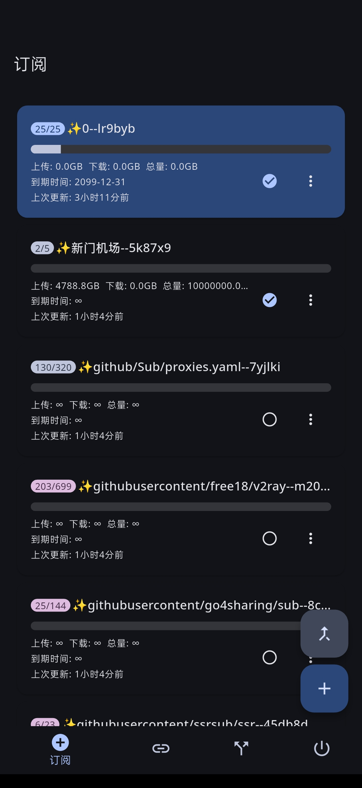
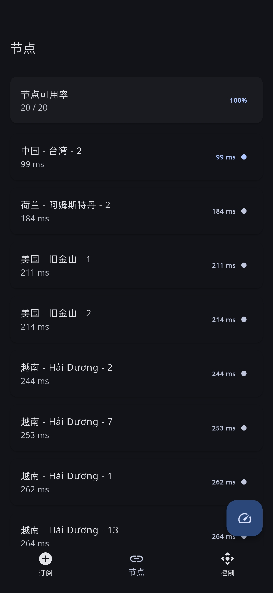

<p align="center">
  <a href="https://www.google.com/search?q=Emoji+Kitchen">
    
  </a>

<h3 align="center">mihomoR</h3>

  <p align="center">
    基于Flutter框架的mihomo内核控制器,仅限Root用户
    <br>
    订阅切换,配置覆写,内核启停
    <br>
    <a href="https://github.com/4evergr8/atoolbox/issues/new">🐞故障报告</a>
    ·
    <a href="https://github.com/4evergr8/atoolbox/issues/new">🏹功能请求</a>
  </p>

## 项目碎碎念😅
我真的裂开,Flclash在手机上开了各种权限,总会出现偶尔连不上的情况  
之前用MIUI14,甚至会自动取消Flclash的无限制后台权限,重新改成"智能优化后台运行",换了ColorOS15,还是会出现断联  
找了一些使用Root权限的mihomo实现,除了无法切换订阅就是根本连不上,只能自己写一个了......  
软件使用tun模式启动mihomo,通过改变config.yaml后重载实现切换订阅,没有分应用代理,靠订阅内规则实现分流  
使用yaml进行覆写过于困难,之后会修改成和Flclash一样的JavaScript覆写 
Flutter的SDK真占内存,16G内存,开个IDEA,开个GitHub Desktop,再开两个Chrome标签页,回头一看,啊,IDEA崩了😅
## 主要功能
### 订阅页面

* 下载Clash订阅
* 删除订阅
* 切换订阅
* 批量更新订阅
* 从返回头自动获取配置名称和流量信息


### 控制页面

* 启动核心
* 停止核心
* 打开WebUI
* 查看核心状态


## 软件截图

<div align="center">
  
  
</div>


## 食用方法
* 前往[Release](https://github.com/4evergr8/mihomoR/releases)下载对应架构的APK和mihomo.zip
* 安装APK并授予Root权限,解压mihomo.zip到data/adb文件夹下,确保mihomo核心位于/data/adb/mihomo/mohomo
* 添加订阅并启动核心
* 前往WebUI观察运行情况


## 配置文件
### settings.yaml 软件设置
```yaml
start: "su -c 'cd /data/adb/mihomo && nohup ./mihomo -d . >/dev/null 2>&1 &'"
#mihomo启动命令
kill: "su -c 'killall mihomo'"
#mihomo停止命令
check: "su -c 'ps -p $(pidof mihomo) -o pid,ppid,%cpu,%mem,cmd; cat /proc/$(pidof mihomo)/status'"
#查看mihomo状态
ua: "clash.meta"
#下载订阅时使用的User-Agent
port: 9090
#软件打开的控制端口,需要和配置中的端口对应
selected: example
#当前选中的订阅的ID
```

### subscriptions.yaml 订阅信息
```yaml
subscriptions:
  - id: "example"
    #订阅的ID,一般为时间戳,同时用作文件名
    link: "https://raw.githubusercontent.com/4evergr8/mihomoR/refs/heads/main/mihomo/example.yaml"
    #订阅下载链接
    label: "测试订阅"
    #订阅显示名称
    upload: 536870912000
    #订阅已使用上传流量(来自服务商)
    download: 536870912000
    #订阅已使用下载流量(来自服务商)
    total: 1073741824000
    #订阅套餐总量(来自服务商)
    expire: 1775696117
    #订阅到期时间(来自服务商)

```
### rewrite.yaml 非递归配置覆写
```yaml
port:
mixed-port:
sniffer:
tunnels:
tun:
  enable: true
  stack: system
  device: utun0
  auto-route: true
  auto-detect-interface: true
  strict-route: true
mode: rule
external-controller: 127.0.0.1:9090
external-ui: ./metacubexd
allow-lan: false
log-level: silent
ipv6: true
disable-keep-alive: true
unified-delay: true
tcp-concurrent: true
geodata-loader: memconservative


dns:
  enable: true
  cache-algorithm: lru
  prefer-h3: false
  listen: 0.0.0.0:1053
  ipv6: true
  enhanced-mode: fake-ip
  fake-ip-range: 198.18.0.1/16
  fake-ip-filter-mode: blacklist
  fake-ip-filter:
    - geosite:cn
    - geosite:geolocation-cn
    - geosite:private
  use-hosts: false
  use-system-hosts: true
  respect-rules: true
  default-nameserver:
    - tls://1.12.12.12:853
    - tls://223.5.5.5:853
  proxy-server-nameserver:
    - https://dns.alidns.com/dns-query
    - https://dns.pub/dns-query
  nameserver-policy:
    geosite:cn,geolocation-cn,private:
      - tls://1.12.12.12:853
      - tls://223.5.5.5:853
  nameserver:
    - https://dns.cloudflare.com/dns-query
    - https://dns.google/dns-query


rules:
  - IP-CIDR,0.0.0.0/32,REJECT
  - DOMAIN-REGEX,^ad\..*,REJECT
  - DOMAIN-REGEX,.*\.ad\..*,REJECT
  - GEOSITE,category-ads-all,REJECT

  - GEOSITE,cn,DIRECT
  - GEOSITE,geolocation-cn,DIRECT
  - GEOSITE,private,DIRECT
  - GEOIP,cn,DIRECT
  - GEOIP,private,DIRECT

  - GEOSITE,CATEGORY-AI-!CN,🧠人工智能🧠

  - MATCH,⚡自动选择⚡


proxy-groups:
  - name: ⚡自动选择⚡
    type: url-test
    url: https://web.telegram.org
    exclude-filter: 订阅|到期|官网|剩余|RU|俄罗斯|🇷🇺|KR|韩国|🇰🇷
    include-all: true
    icon: https://raw.githubusercontent.com/Koolson/Qure/master/IconSet/Dark/Speedtest.png
    interval: 300
    lazy: true
    timeout: 2000
    max-failed-times: 2
    tolerance: 50
    proxies: []

  - name: 🧠人工智能🧠
    type: url-test
    url: https://chatgpt.com
    exclude-filter: 订阅|到期|官网|剩余|RU|俄罗斯|🇷🇺|HK|香港|🇭🇰   #|US|美国|🇺🇸
    include-all: true
    icon: https://raw.githubusercontent.com/Koolson/Qure/master/IconSet/Dark/Bot.png
    interval: 300
    lazy: true
    timeout: 2000
    max-failed-times: 2
    tolerance: 50
    proxies: []
```
## 引用

* 本项目采用GithubAction进行编译
* 软件界面参考[chen08209/FlClash](https://github.com/chen08209/FlClash)
* WebUI来自[MetaCubeX/metacubexd](https://github.com/MetaCubeX/metacubexd)
* 规则集合来自[MetaCubeX/meta-rules-dat](https://github.com/MetaCubeX/meta-rules-dat)
