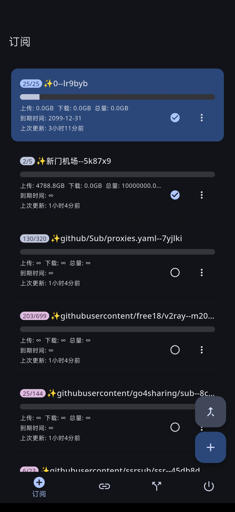
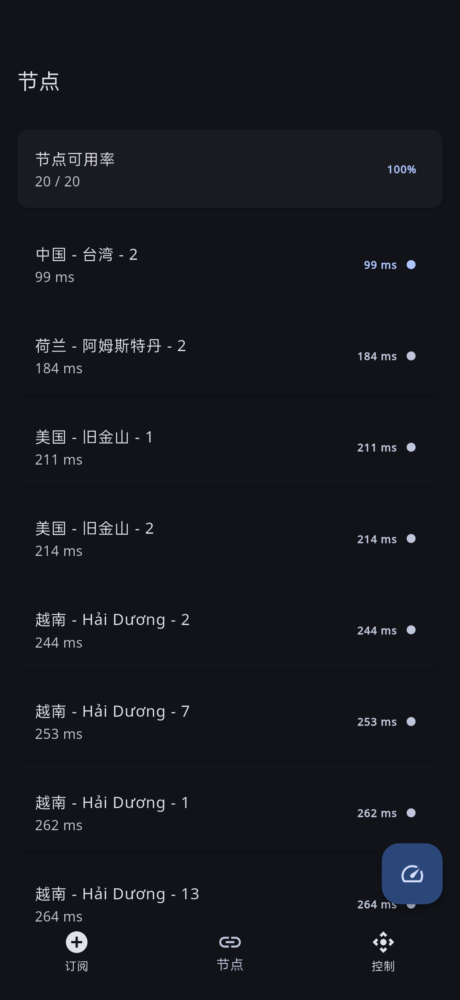
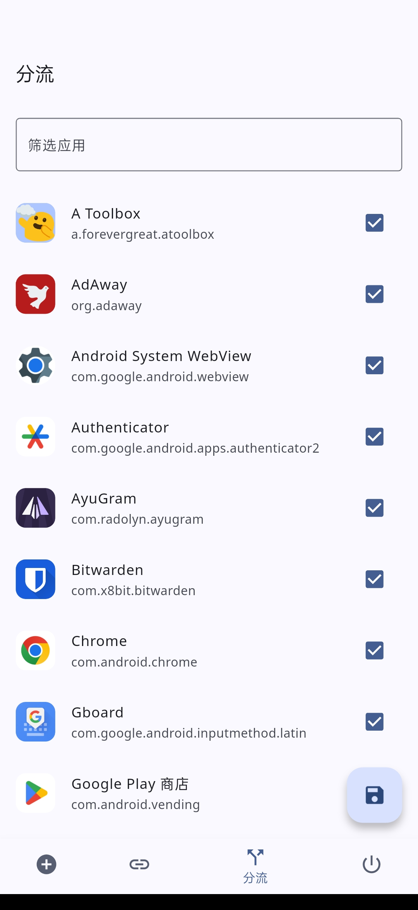
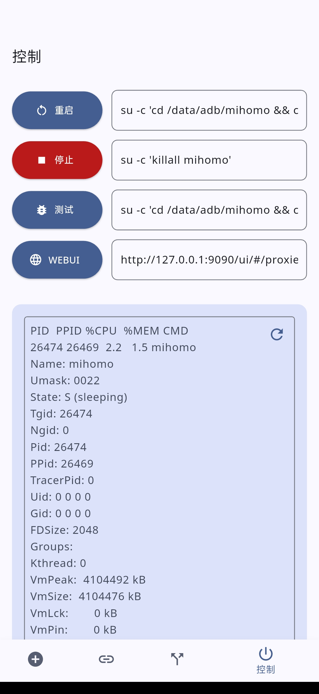

# ClashRoot

<p align="center">
  


</p>

<h3 align="center">ClashRoot</h3>

<p align="center">
  基于Flutter框架的Clash内核控制器,仅限KernelSU<br>
  订阅切换、配置覆写、内核启停<br>
  <a href="https://github.com/4evergr8/ClashRoot/issues/new">🐞故障报告</a>
  ·
  <a href="https://github.com/4evergr8/ClashRoot/issues/new">🏹功能请求</a>
</p>

## 目录

- [主要功能](#主要功能)
- [Screenshots](#screenshots)
- [食用方法](#食用方法)
- [配置文件](#配置文件)
- [引用](#引用)

## 主要功能

- 磁贴控制核心启停
- 通知监控网速
- 分应用代理,支持白名单和黑名单模式
- 批量添加Clash订阅
- 删除订阅
- 切换订阅
- 批量更新订阅
- 订阅覆写
- 从返回头自动获取配置名称和流量信息
- 对配置中的所有节点进行测速,可自定义超时和测速链接
- 查看核心状态

## Screenshots

<table>
  <tr>
    <td width="25%"></td>
    <td width="25%"></td>
    
   
  </tr>
</table>
<table>
  <tr>
<td width="25%"></td>
    <td width="25%"></td>
    <td width="25%"></td>
  </tr>
</table>
## 食用方法

1. 前往[Release](https://github.com/4evergr8/ClashRoot/releases)下载对应架构的APK和ClashRoot.zip
2. 在KernelSU内安装ClashRoot.zip,授予ClashRoot应用root权限,重启设备
3. 由于每次构建会生成不同的签名,只有开启核心破解后才能更新app,无法更新请前往模块目录手动安装apk
4. 添加订阅,选中订阅后重启核心
5. 前往WebUI观察运行情况

## 配置文件

### data.yaml 软件数据

```yaml
ua: "clash.meta"
#下载订阅时使用的User-Agent
port: 9090
#软件打开的控制端口,需要和配置中的端口对应
timeout: 10000
#下载订阅超时,毫秒
url: "https://www.google.com"
#节点测速链接
secret: "111111"
#Clash API密码
testtimeout: 3000
#节点测速超时,毫秒
expected: 200
#节点测速返回码,只有匹配的返回码才算alive
subscriptions:
  - id: "example"
    #订阅的ID,链接标准化后,进行SHA256计算,取前8位,同时用作文件名
    link: "https://raw.githubusercontent.com/4evergr8/FlutterClashRoot/refs/heads/main/ClashRoot/config.yaml"
    #订阅下载链接
    label: "测试订阅"
    #订阅显示名称
    upload: 536870912000
    #订阅已使用上传流量(来自服务商)
    download: 536870912000
    #订阅已使用下载流量(来自服务商)
    total: 1073741824000
    #订阅套餐总量(来自服务商)
    expire: 1775696117
    #订阅到期时间(来自服务商)
    update: 0
    #上次更新时间
    count: 0
    #可用节点数量
    favorite: true
    #是否收藏订阅,收藏的订阅会被置顶
    select: true
    #是否选中订阅
```

### override.yaml 配置覆写,仅支持简单替换

```yaml
mode: rule
external-controller: 127.0.0.1:9090
secret: "111111"
external-ui: ./metacubexd
allow-lan: false
log-level: warning
ipv6: false
disable-keep-alive: true
keep-alive-idle: 10
keep-alive-interval: 60
unified-delay: false
tcp-concurrent: true
geodata-loader: memconservative
find-process-mode: off
geo-auto-update: true
geo-update-interval: 24
etag-support: true
geodata-mode: true
geox-url:
  geoip: "https://cdn.jsdelivr.net/gh/Loyalsoldier/v2ray-rules-dat@release/geoip.dat"
  geosite: "https://cdn.jsdelivr.net/gh/Loyalsoldier/v2ray-rules-dat@release/geosite.dat"
profile:
  store-selected: false
  store-fake-ip: true


tun:
  enable: true
  stack: "gvisor"
  device: "tun0"
  auto-route: true
  auto-detect-interface: true
  strict-route: true


dns:
  enable: true
  cache-algorithm: lru
  listen: 0.0.0.0:1053
  ipv6: false
  enhanced-mode: fake-ip
  fake-ip-range: 198.18.0.1/16
  fake-ip-filter-mode: blacklist
  fake-ip-filter:
    - GEOSITE,cn
    - GEOSITE,googlefcm
    - GEOSITE,samsung
    - GEOSITE,private
  nameserver:
    - tls://119.29.29.29:853
    - tls://223.5.5.5:853


rules:
  - GEOSITE,category-ads-all,REJECT
  - RULE-SET,Advertising_OCD_IP,REJECT,no-resolve

  - GEOIP,private,DIRECT,no-resolve
  - DOMAIN-SUFFIX,pages.dev,DIRECT
  - GEOSITE,cn,DIRECT
  - GEOSITE,googlefcm,DIRECT
  - GEOSITE,samsung,DIRECT
  - GEOSITE,private,DIRECT

  - GEOIP,telegram,⚖️负载均衡⚖️,no-resolve
  - GEOSITE,telegram,⚖️负载均衡⚖️
  - GEOSITE,huggingface,⚖️负载均衡⚖️
  - GEOSITE,category-netdisk-!cn,⚖️负载均衡⚖️

  - GEOSITE,category-ai-!cn,🧠人工智能🧠

  - GEOSITE,dlsite,🇯🇵日本节点🇯🇵
  - GEOSITE,dmm,🇯🇵日本节点🇯🇵
  - GEOSITE,pixiv,🇯🇵日本节点🇯🇵

  - GEOSITE,geolocation-!cn,📍节点选择📍
  - GEOSITE,tld-!cn,📍节点选择📍

  - GEOIP,cn,DIRECT

  - MATCH,📍节点选择📍


rule-providers:
  Advertising_OCD_IP:
    type: http
    path: ./rule/Advertising_OCD_IP.mrs
    url: "https://cdn.jsdelivr.net/gh/peiyingyao/Rule-for-OCD@master/rule/Clash/Advertising/Advertising_OCD_IP.mrs"
    interval: 86400
    proxy: DIRECT
    behavior: ipcidr
    format: mrs


proxy-groups:
  - name: 📍节点选择📍
    type: select
    interval: 0
    proxies:
      - ⚡自动选择⚡
      - ⚖️负载均衡⚖️
      - 🇯🇵日本节点🇯🇵
      - 🇺🇸美国节点🇺🇸

  - name: ⚡自动选择⚡
    type: url-test
    url: https://www.google.com/generate_204
    expected-status: 204
    interval: 1800
    timeout: 3000
    max-failed-times: 3
    tolerance: 100
    exclude-filter: 订阅|频道|到期|官网|剩余|RU|俄罗斯|🇷🇺|KR|韩国|🇰🇷
    include-all-proxies: true
    proxies: [ ]

  - name: 🧠人工智能🧠
    type: url-test
    url: https://api.openai.com/v1/models
    expected-status: 401
    interval: 1800
    timeout: 3000
    max-failed-times: 3
    tolerance: 100
    exclude-filter: 订阅|频道|到期|官网|剩余|RU|俄罗斯|🇷🇺 #|HK|香港|🇭🇰|US|美国|🇺🇸
    include-all-proxies: true
    proxies: [ ]

  - name: ⚖️负载均衡⚖️
    type: load-balance
    strategy: consistent-hashing
    url: https://cdn5.telegram.org
    interval: 1800
    timeout: 3000
    max-failed-times: 3
    tolerance: 100
    exclude-filter: 订阅|频道|到期|官网|剩余|RU|俄罗斯|🇷🇺|KR|韩国|🇰🇷  #|VN|越南|🇻🇳|MY|马来西亚|🇲🇾|🇷🇺
    include-all-proxies: true
    proxies: [ ]

  - name: 🇯🇵日本节点🇯🇵
    type: url-test
    url: https://www.google.com/generate_204
    expected-status: 204
    interval: 1800
    timeout: 3000
    max-failed-times: 3
    tolerance: 100
    filter: JP|日本|🇯🇵
    include-all-proxies: true
    proxies: [ ]

  - name: 🇺🇸美国节点🇺🇸
    type: url-test
    url: https://www.google.com/generate_204
    expected-status: 204
    interval: 1800
    timeout: 3000
    max-failed-times: 3
    tolerance: 100
    filter: US|美国|🇺🇸
    include-all-proxies: true
    proxies: [ ]

```

## 引用

- 本项目采用GitHub Action进行编译
- 部分软件界面参考[chen08209/FlClash](https://github.com/chen08209/FlClash)
- WebUI来自[MetaCubeX/metacubexd](https://github.com/MetaCubeX/metacubexd)
- 规则集合来自[Loyalsoldier/v2ray-rules-dat](https://github.com/Loyalsoldier/v2ray-rules-dat)
